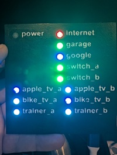

# e-networkstatus

This is a LED dashboard to display nework status in the "zwift" cycling room, without having to open ones "technology" to check if the network is healthy.
- 

- It uses "uptime kuma" for the actual health checks.
- It uses "raspi pico-w" to poll the "uptime kuma" server for the "status" at the time of polling.
- So, the "raspi pico" does not actually check the "status" of the network devices, rather, it simply reports on LEDs what "uptime kuma" has gathered.
- Things to be checked, need to be added to ANY status page inside Uptime Kuma, as this makes the BADGE for that page become public.  If you skip this step, you would get a "N/A" type icon when checking the status.

## hardware
- [3d model](3d/ping_case.scad)
## electronics
- raspi pico-w (we need wifi).
- 5mm LED * 18
- 51Ω Resistor * 18
- hookup wire
### schematic
- [schematic](schematic/e-networkstatus/Schematic.png)
## software
- [uptime_kuma.py](micropython/uptime_kuma.py)
- [config manager](micropython/configmgr.py) 
  - [github repo](https://github.com/Uthayamurthy/ConfigManager-Micropython)
- [uptime kuma](https://uptimekuma.co/)
## configuration
- [config](micropython/config/config.conf)